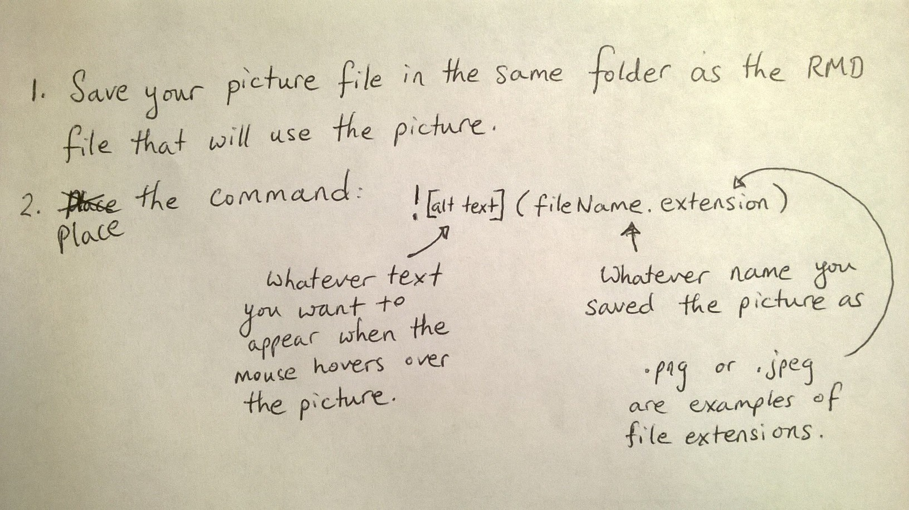

<script type="text/javascript">
 function showhide(id) {
    var e = document.getElementById(id);
    e.style.display = (e.style.display == 'block') ? 'none' : 'block';
 }
</script>

----

Here is a simplified [cheat sheet](https://www.rstudio.com/wp-content/uploads/2015/02/rmarkdown-cheatsheet.pdf) as well for quick reference.

----

# \# Make a Section Heading

Then write your text here...

## \#\# Make a Subsection Heading

Then write your text here...

### \#\#\# Make a Sub-subsection Heading

Then write your text here...

#### \#\#\#\# Make a Sub-sub-subsection Heading

Then write your text here...

##### \#\#\#\#\# Yet another subsection

Then write your text here...

###### \#\#\#\#\#\# The final sub heading

Then write your text here...


<br />

# Emphasizing Words

To *italisize* a word use the asterisk (Shift 8) `*italisize*`. To **bold** a word use the double asterisk `**bold**`. (Notice how the back tic ` ` ` can be used to emphasize words as well.)

<br />

# Bullet Points

#### Simple Lists

<div style="float:left;width:300px;">
To achieve the result:

* This is the first item.

* This is the second.

* This is the third.

</div>

<div style="padding-left:350px;">

Use the code:

```{r, eval=FALSE}
* This is the first item.

* This is the second.

* This is the third.
```

</div>

<div style="clear:both;"></div>

#### Numbered Lists

<div style="float:left;width:300px;">

To achieve the result:

1. This is the first item.

2. This is the second.

3. This is the third.

</div>

<div style="padding-left:350px;">

Use the code:

```{r, eval=FALSE}
1. This is the first item.

2. This is the second.

3. This is the third.
```

</div>

<div style="clear:both;"></div>

#### Lettered Lists

<div style="float:left;width:300px;">

To achieve the result:

A) This is the first item.

B) This is the second.

C) This is the third.

</div>

<div style="padding-left:350px;">
Use the code:

```{r, eval=FALSE}
A) This is the first item.

B) This is the second.

C) This is the third.
```


</div>

<div style="clear:both;"></div>


#### Nested Lists

<div style="float:left;width:300px;">

1. What is $2+2$?

    a. **4**
    
    b. 8
  
2. What is $3\times5$?

    a. 14
    
    b. **15**

</div>

<div style="padding-left:350px;">

```{r, eval=FALSE}
1. What is $2+2$?

    a. **4**
    
    b. 8
  
2. What is $3\times5$?

    a. 14
    
    b. **15**

```

</div>
    
# Math Equations

Use the dollar signs `$x=5$` to write $x=5$ or `$z=\frac{x-\mu}{\sigma}$` to write $z=\frac{x-\mu}{\sigma}$. For a nicely centered equation use the double dollar signs `$$ $$` on separate lines 

```{r, eval=FALSE}
$$
  z = \frac{\bar{x}-\mu}{\frac{\sigma}{\sqrt{n}}}
$$
```

to get
$$
  z = \frac{\bar{x}-\mu}{\frac{\sigma}{\sqrt{n}}}
$$

Or

```{r, eval=FALSE}
$$
  H_0: \mu_1 = \mu_2
$$
$$ 
  H_a: \mu_1 \neq \mu_2
$$
```

to get
$$
  H_0: \mu_1 = \mu_2
$$
$$ 
  H_a: \mu_1 \neq \mu_2
$$

<br />

# Insert a Picture

To add a picture to your document, say some notes you took down on paper from class,

``



<br />

# Tables

There are many ways to [make tables](http://rmarkdown.rstudio.com/authoring_pandoc_markdown.html#tables) in R Markdown. Here is a simple way to make a "pipe" table.

```{r, eval=FALSE}
| Name          | Age           | Gender       | 
|---------------|---------------|--------------|
| Jill          | 8             |  Female      |
| Jack          | 9             |  Male        |
```

| Name          | Age           | Gender       | 
|---------------|---------------|--------------|
| Jill          | 8             |  Female      |
| Jack          | 9             |  Male        |


<br />

# Themes

Notice in the YAML (at the top of the RMD file) there is a line that reads:

"theme: cerulean"

Other possible themes are

* "default", "cerulean", "journal", "flatly", "readable", "spacelab", "united", and "cosmo".

You can also change the `highlighting` by adding the line "highlight: tango" to the YAML as follows.

```{r, eval=FALSE}
---
title: "Markdown Hints"
output: 
  html_document:
    theme: cerulean
    highlight: tango
---
```

Other highlighting options are

* "default", "tango", "pygments", "kate", "monochrome", "espresso", "zenburn", "haddock", and "textmate".

<br />

# 

# More Information

Go to the [rmarkdown.rstudio.com](http://rmarkdown.rstudio.com/html_document_format.html) website for more information on how to use R Markdown.

