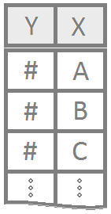
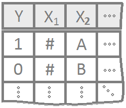

 

----

Customize this page so that it becomes a useful *Guide to Statistical Analysis* for your *current* and *future* self. 

----

<!-- Add your customizations in the area below: -->

## 1 Quantitative Variable

### Question
* How is this data distributed? 

* Is the mean zero or greater, less, equal to some number?

* What is the mean? 

* Is the mean this value?

* How much money gain or lose?

* Is the median this value? (nonparametric test)

* What is the median? (nonparametric test)

* Wanted to know if they were getting ripped off

Example: Height
A [histogram](GraphicalSummaries.html) is a good way to summarize a single quantitative variable.

See [Math 221 Wiki: histograms](http://statistics.byuimath.com/index.php?title=Lesson_3:_Describing_Quantitative_Data:_Shape,_Center_%26_Spread#Visualizing_Quantitative_Data:_Histograms)

#### One Sample T-Test

$H_0: \mu = \text{some number}$

$H_a: \mu \ \left\{\underset{<}{\stackrel{>}{\neq}}\right\} \ \text{some number}$

Graphics: [boxplot](GraphicalSummaries.html), [dot plot](GraphicalSummaries.html) or [histogram](GraphicalSummaries.html)

#### Paired Sample T-Test

**Questions**

* Comparing two things and finding the difference between the two.  

$H_0: \mu_d = \text{some number, but typically 0}$  
$H_a: \mu_d \ \left\{\underset{<}{\stackrel{>}{\neq}}\right\} \ \text{some number, but typically 0}$

Graphics: [boxplot](GraphicalSummaries.html), [dot plot](GraphicalSummaries.html) or [histogram](GraphicalSummaries.html) (of the differences)

#### Wilcoxon Signed-Rank 
Skewed distributions

$H_0: \text{median of differences} = 0$

$H_a: \text{median of differences} \ \left\{\underset{<}{\stackrel{>}{\neq}}\right\} \ 0$

Symmetric distributions
$$
  H_0: \mu = 0
$$
$$
  H_a: \mu \neq 0
$$

Graphics: [boxplot](GraphicalSummaries.html)

<!------------------------------------------------>

----

<!-- Add your customizations in the area below: -->

## 1 Quantitative Variable | 2 Groups

### Questions 

Is there a difference in means/medians?
Is one group stochastically dominant over the other? 

Example: Height and gender

#### Independent T-Test

$H_0: \mu_1 - \mu_2 = \text{some number, but typically 0}$
$H_a: \mu_1 - \mu_2 \ \left\{\underset{<}{\stackrel{>}{\neq}}\right\} \ \text{some number, but typically 0}$

Graphics: [dot plot](GraphicalSummaries.html) or [boxplot](GraphicalSummaries.html) 

#### Wilcoxon Rank Sum 
Symmetric distributions

$H_0: \text{difference in medians} = 0$

$H_a: \text{difference in medians} \neq 0$

Different distributions 

$H_0: \text{the distributions are stochastically equal}$

$H_a: \text{one distribution is stochastically greater than the other}$

Graphics: [boxplot](GraphicalSummaries.html)

<!------------------------------------------------>

----

<!-- Add your customizations in the area below: -->

## 1 Quantitative Variable | 3+ Groups

### Questions 
Are any of the means equal?

Use these to Analyis
[ANOVA](ANOVA.html)

Example: Height, gender, eye color, race, age, class

#### ANOVA
Means 

$$
  H_0: \alpha_1 = \alpha_2 = \ldots = 0
$$
$$
  H_a: \alpha_i \neq 0 \ \text{for at least one} \ i
$$

Graphics: Required QQ Plot and Residuals also need either xyplot or mPlot

#### Kruskal - Wallis Rank Sum 

$$
  H_0: \text{All samples are from the same distribution.}
$$ 
$$
  H_a: \text{At least one sample's distribution is stochastically different.}
$$
Also could use ANOVA Format

$$
  H_0: \mu_1 = \mu_2 = \ldots = \mu
$$
$$
  H_a: \mu_i \neq \mu \ \text{for at least one} \ i
$$

<!------------------------------------------------>

----

<!-- Add your customizations in the area below: -->

## 2 Quantitative Variables

Example:  Height and Weight 

### Question

Is there a linear relationship between 2 number quantities?

### Simple Linear Regression 

[Linear Regression](LinearRegression.html)

$$
\left.\begin{array}{ll}
H_0: \beta_1 = 0 \\  
H_a: \beta_1 \neq 0
\end{array}
\right\} \ \text{Slope Hypotheses}^{\quad \text{(most common)}}\quad\quad
$$

$$
\left.\begin{array}{ll}
H_0: \beta_0 = 0 \\  
H_a: \beta_0 \neq 0
\end{array}
\right\} \ \text{Intercept Hypotheses}^{\quad\text{(sometimes useful)}}
$$

Graphics: Line of best fit plot 

<!------------------------------------------------>

----

<!-- Add your customizations in the area below: -->

## 1 Quantitative Response | Multiple Explanatory Variables

X Values can be unrelated

Example: Height, weight, gender

#### Multiple Linear Regression  

The most typical tests for multiple regression are t Tests for a single coefficient. The hypotheses for these t Tests are written as
$$
  H_0: \beta_j = 0
$$
$$
  H_a: \beta_j \neq 0
$$

* The F Test allows a single test for any group of hypotheses simultaneously.

The most commonly used F Test is the one given by the hypotheses
$$
  H_0: \beta_0 = \beta_1 = \cdots = \beta_p = 0
$$
$$
  H_a: \beta_j \neq 0 \ \text{for at least one}\ j \in \{0,1,\ldots,p\}
$$

<!------------------------------------------------>

----

<!-- Add your customizations in the area below: -->

## Binomial Response | 1 Explanatory Variable

Questions:  
* Can gestation period be predicted based off mother's age?  

* For which x values is true most likely?

* Probability launch now will result in 0 ring failure given the opposite temp. 

1 or 0 (success or failure) with hours spent doing homework.  
8+hours=success/1 or 7-hours=failure/0 

#### Logistic Regression 

$$
  H_0: \beta_1 = 0 \\
  H_a: \beta_1 \neq 0
$$

Graphics:  Custom plot with Curve 

<!------------------------------------------------>

----

<!-- Add your customizations in the area below: -->

## Binomial Response | Multiple Explanatory Variables

1 or 0 (success or failure) with hours spent doing homework.  
8+hours=success/1 or 7-hours=failure/0 PLUS gender, eating berakfast, etc. 

<!------------------------------------------------>

----

<!-- Add your customizations in the area below: -->

## 2 Qualitative Variables

Gender and hair color 

### Chi-Squared 

* Row variable and column variable are independent

* Row and column variable are associated (not independent)

* Independent pattern is the **same** (independent regardless of the group) 

* Associated pattern is **different** from each other (associated with the group)

<!------------------------------------------------>

----

<footer></footer>

